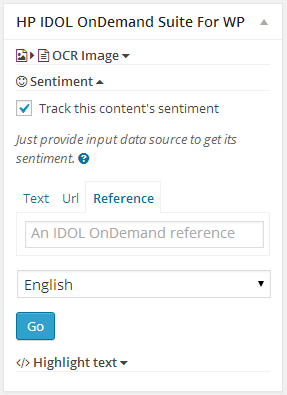
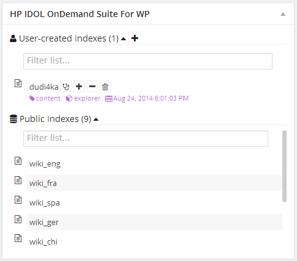
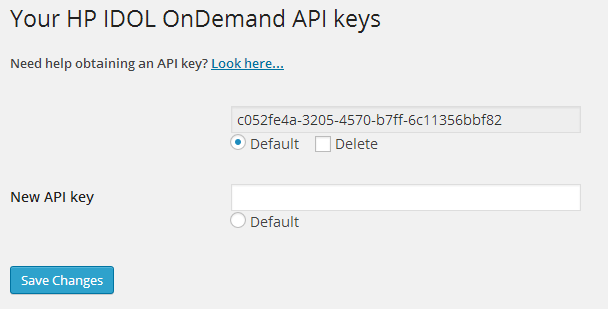

# HP IDOL OnDemand Suite For WP

**WP plugin** bundling a collection of tools which ease the workflow when working with the **HP IDOL OnDemand API**.

Provides following sub modules:

* **HTTPClient** - Represents abstract class wrapping the build in WP HTTP API in easy to use bundle (the OOP way) capable of accessing the HP IDOL OnDemand API.
* **APIkeyManager** - Organizes the storage and management of the API keys used to access the IDOL API.
* **ContentEditWidget** - Represents class providing useful services when content (post/page) is edited or created.
* **DashBoardWidget** - Represnts widget on the admin dashboard.

## How it looks like?

## Installation
**Way 1(better):**

* In WP admin area go to **Plugins -> Add New -> Upload** and upload the plugin's [.zip file](https://github.com/mtserve/IDOL-OnDemand-Suite-WP/raw/master/dist/HP_IDOL_OnDemand_Suite_For_WP.zip)

*Done!*

**Way 2:**

1. Upload plugin's [.zip file](https://github.com/mtserve/IDOL-OnDemand-Suite-WP/raw/master/dist/HP_IDOL_OnDemand_Suite_For_WP.zip) to the "/wp-content/plugins/" directory.
2. Extract it there.
3. Activate the plugin through the "Plugins" menu in WordPress.

*Done!*

## Frequently Asked Questions
- How can I change the HP IDOL API key the suite is currently using?
  * The suite is equipped with a options page under the "Settings"  menu in WP's admin area. Try there.
- Where can I find help when needed?
  * Look at the [Wiki](https://github.com/mtserve/IDOL-OnDemand-Suite-WP/wiki) pages.
  * Open an [issue](https://github.com/mtserve/IDOL-OnDemand-Suite-WP/issues) when you know what you are doing.

## Available in:
- English

## Contributing
Pull requests welcome! What you will need to do to contribute is:

- Fork, then clone this repo.
- Make your changes/updates.
- Push to your fork and submit a pull request.

Translators are welcome too!

## Developer guide
Is [here](https://github.com/mtserve/IDOL-OnDemand-Suite-WP/wiki/Developer-guide).

## License
GPLv2 or later
